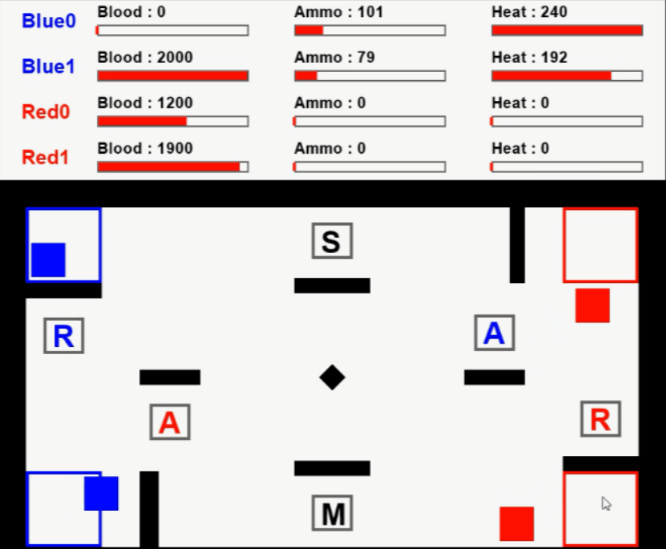
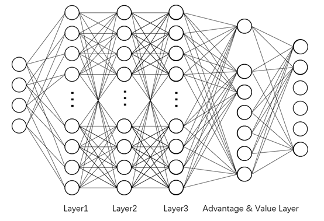
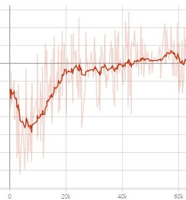
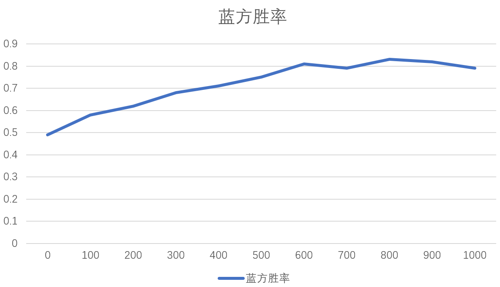

该项目是ICRA2020 AI Challenge I Hiter战队的Decision功能代码展示

# 1. 软件功能介绍

决策部分的软件包括**强化学习环境仿真及可视化**
和**深度强化学习网络训练部分**。其中：

* **强化学习环境仿真及可视化**是通过模拟比赛机器人的比赛状态，将比赛的过程抽象为马尔可夫决策过程,按照gym的环境编写规范的要求书写的。同时在算法上还需要满足足够的快速性，使强化训练的训练过程能够快速进行。

* **深度强化学习网络训练部分**是通过搭建深度强化学习网络，对大量的样本进行训练。以当前赛场上的可观测状态作为输入，输出每个动作的得分，选取得分最高的动作为下一步的动作。

# 2. 软件功能和效果展示

## 比赛场地俯视图演示

本软件使用pyglet作为图形渲染库，
地图上面的色块如下所示：

* 蓝色方块代表我方机器人
* 红色方块代表敌方机器人
* 用黑色的小方块表示障碍物和边界
* 红色和蓝色的框表示机器人在比赛开始出发的位置
* 灰色的框表示Buff区域

Buff区域的颜色和字母规则如下所示

* 红色表示着红方的加成区，
* 蓝色表示蓝方的加成区，
* 黑色代表着禁止区。
* 字母*A*代表加弹药，
* 字母*R*代表回血，
* 字母*M*代表禁止移动，
* 字母*S*代表禁止射击。

<p align="center">
  
</p>  

## 比赛过程仿真演示

机器人在仿真模拟的过程中需要进行大量的运算，
为此在比赛过程的仿真演示中使用了一些技术加速运算。

检验机器人是否撞击障碍物是算法计算量较大的部分。
本软件通过检验机器人与障碍物的几何关系实现了碰撞判定，
为了最大限度减少计算量，
本软件使用Numpy进行矩阵计算来计算线与线的位置关系，
在此基础上，
来计算出线与矩形的位置关系，
并且根据线与矩形的位置关系来计算出矩形与矩形的位置关系。
在确定线段与线段的位置关系中，
本文使用了高度集成的叉乘算法，
大大降低了算法的运行时间，
为强化学习的训练工作提供了保障。

在buff部分，
本软件按照比赛的规则写出了一个buff检测和运行的系统，
当机器人进入buff区域会触发buff，
并且当一定时间之后还会取消禁止类buff，
在触发加成类buff的时候能够进行加血和加弹药的行为。
在30s之后对buff区域进行刷新。

在射击的部分，
该环境可以检测机器人的射击指令是否可以击中预定的目标靶。
能够增加热量值，
当超过热量值的时候机器人将停止射击。
如果弹药耗尽，
机器人也无法射击，
并且将以上的的结果进行输出。

## 机器人状态显示

为了能够显示机器人在运行的情况，
本软件在俯视图的上方对每个机器人的基本状态进行描述。
包括血量、弹药量、枪口温度进行显示，
并使用一个颜色条表示大小。

# 3. 依赖环境

## tensorflow-gpu >= 1.4

tensorflow-gpu是基于gpu运算的深度学习处理库，
用于训练以及运行深度学习模型

## tensorboard == 1.14.0

tensorborad是用于深度学习过程可视化的软件，
如没有训练要求可以选择性安装

## python 3.6

算法需要在3.6+的环境下运行

## pyglet

pyglet是一个基于OpenGL的一个轻量型的渲染工具，
用于图形的可视化

## Numpy

numpy是用于维度数组与矩阵运算的python拓展库，
根据对应的版本进行选择即可

# 4. 安装方法

克隆代码至本地仓库

```bash
git clone https://github.com/MengXiangBo/ICRA2020_RM_IHiter_Decision.git Decision
```

进入程序目录，安装相关的库

```bash
cd decision
pip install pyglet
pip install numpy
pip install tensorflow-gpu == 1.4
```

仿真环境可视化

```bash
python env_show.py
```

训练模型

```bash
python train.py
```

运行如下命令查看训练效果（10局）

```bash
python eval.py
```

# 5. 文件目录

```bash
debug.py
│  DuelingDQN.py # 网络文件
│  env_show.py # 可视化程序展示
│  eval.py # 训练效果评估
│  README.md # 说明书
│  train.py # 训练文件
│
├─IHiterEnv # 可视化与仿真环境文件夹
│      agent.py # 存储一些机器人的类
│      display.py # 存储了可视化的一些类
│      env.py # 仿真环境的主文件
│      map_element.py # 地图的一些元素
│      parameter.py # 参数文件
│      policy.py # 策略文件
│      __init__.py
│
└─train_data # 训练数据文件夹
    │  param.txt # 超参数记录文件
    ├─CheckpointsFile # 权重文件
    └─Summary # 训练产生的eventout文件
```

# 6. 原理及理论分析

## 6.1 强化学习仿真环境

决策系统仿真环境是决策系统算法的实验平台，
需要输出大量的状态和执行动作的反馈信息。
为了使决策系统能够在短时间内获得大量的训练样本，
本组搭建了一个可以用于机器人的移动、射击动作的环境系统。

仿真环境的实验平台是回合制的，
即每次输入的动作将改变机器人的状态，
每两次输入动作之间，
机器人的状态和仿真环境不会发生改变。

机器人的动作是由射击动作和移动动作构成，
机器人的移动和射击动作是离散化的，
具体的实施情况如下：

* 机器人的枪管和移动方向是一致的
* 机器人下一步的移动动作为九宫格中外部的八个方块
* 机器人的射击状态有射击和不射击两种

将蓝方的两个机器人的动作整合到一起就变成蓝队的动作，
由于移动动作有8种可能，
射击动作有2种可能，
于是对于一个机器人来说，
机器人的动作空间是16。
两个机器人的队伍的动作空间就是单个机器人动作空间的平方，
也就是256。

单个机器人的状态由如下几个部分构成：

* 机器人的横坐标
* 机器人的纵坐标
* 机器人枪管角度
* 机器人的血量
* 机器人的弹药
* 机器人的枪管温度

Buff区的分配也由六个部分构成，
分别是六个buff区的buff代号。
将场上的四个机器人的坐标和buff区分配的数组合并到一起，
这样就组成了一个30个数的数组，
将数组归一化之后就组成了环境的状态，
将其输入到强化学习网络中进行训练。

## 6.2 基于值函数的机器人决策系统

在决策中，
我们采用了基于值函数的Dueling DQN网络，
通过神经网络拟合机器人每个状态下对应的动作的Q值，
选择最大的Q值对应的动作来进行决策。
下面将详细介绍该决策子系统的架构。

### 6.2.1 Dueling DQN网络结构

该网络结构由三层网络搭建而成，
第一层和第二层是神经元数量为1024的全连接网络，
激活函数为relu。
第三层分离为一个价值网络和优势网络，
价值网络的只有一个神经元，
输出该状态的价值，
优势网络输出每个动作的优势价值，
以上两个部分的直接输出，
没有激活函数。
然后将动作的优势价值均值归零后加上价值网络的值得到最终的动作Q_eval值。
公式如下：

<p align="center">
  <br>
  
</p>  

在训练过程中，
网络的误差是预测的Q_eval值和模拟真实值Q_real的对比，
其中Q_real的计算方法根据贝尔曼原理得出：

<p align="center">
  <br>
  
</p>  

其中s'为状态s时采取动作a之后的下一步状态，
a_max为对应的在s'状态下能够取得最大的Q_target值的动作，
γ为折扣系数，
θ-为网络的参数。
之后经过前向传播的之后可以得到网络的loss值为：

<p align="center">
  <br>
  
</p>  

采用这种方法可以使target网络的预测值能够在贝尔曼处理后作为近似的真值计算loss值。
同时在网络训练一段时间后，
target网络的所有权重会更新为eval网络的权重。

### 6.2.2 ϵ-greedy探索策略

在训练过程中采用了ϵ-greedy探索策略，
即在训练的早期由于网络的决策能力差，
如果动作完全依赖决策网络，
会陷入不明智行为的陷阱，
所以需要按照一定概率来随机行动进行探索。
随着网络训练的效果越来越好，
随机行动进行探索的概率也会下降，
训练的行动选择也越来越依赖网络选择。

<p align="center">
  
</p>  

## 6.3 环境奖励设定

环境的奖励分为三种，
分别是：

* 移动情况奖励
* 射击情况奖励
* 胜利奖励

在每个step的进行的时候，
环境会记录下每个机器人的移动和射击的结果，
并将其分门别类为几种，
根据不同的结构进行奖励，
移动结果和奖励大小如下：

* 进入禁止类的buff -100
* 进入敌方的加成buff -100
* 进入我方的加成buff +10
* 没有撞上障碍物或者是进入buff区域 -0.1
* 装上障碍物 -100

射击结果：

* 机器人自主决策不射击 -0.1
* 枪管温度过高无法射击 -10
* 有禁止射击的buff无法射击 -10
* 弹药不足无法射击 -10
* 目标已经死亡无法攻击 -10
* 由于障碍物阻挡或者目标不在射击范围内无法射击到 -10
* 攻击成功 +10

最后是否胜利作为一个奖励判定，
胜利将赋予1000的奖励

## 6.4 训练效果

经过大约1000局，
60k步的迭代计算，
智能体的每步的平均收益有了很大的提升，
达到了收敛，
结果如下：

<p align="center">
  
</p>  

在训练过程中，
每训练完100局将会进行100局的测试，
进行胜率计算，
可以得到如下的图表：

<p align="center">
  
</p>  

可以看出，
在训练了600局的时候，
网络的胜率就趋于稳定，
大约在80%左右。
